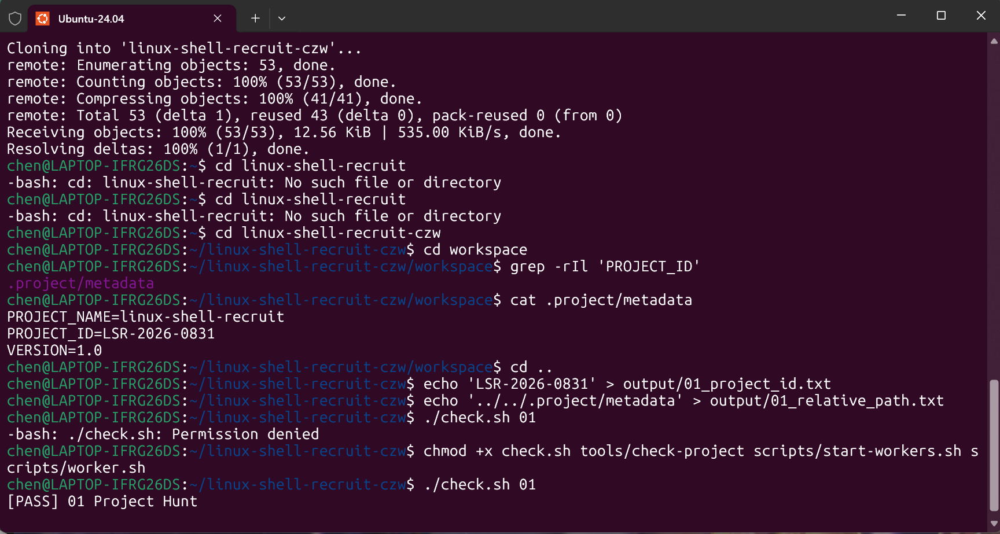
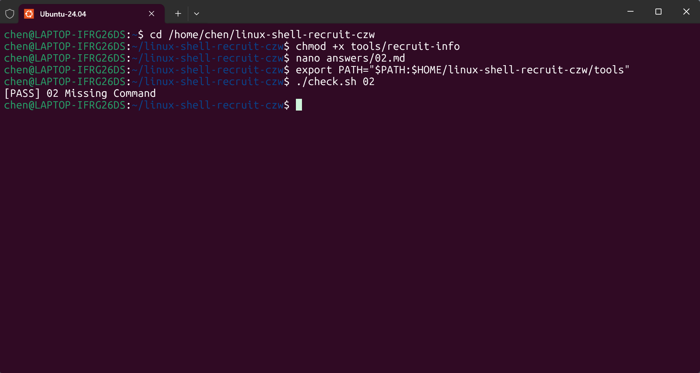

# task 01

## 用到的命令

cd /home/chen/linux-shell-recruit   进入目录

ls -la    显示目录全部内容（包括隐藏文件）

grep -rIl 'PROJECT_ID'   递归搜索包含PROJECT_ID的文件，只列出文件名

cat .project/metadata   查看文件内容，得到项目编号LSR-2026-0831

echo 'LSR-2026-0831' > output/01_project_id.txt   把内容写入文件（重定向）

./check.sh 01   运行校验脚本，确认答案正确

## 学习过程

使用codex协助了解命令以及其作用，并使用GitHub的api在终端中直接将运行结果放入该仓库。该过程对新手来说较为困难，在codex协助下会轻松很多。

## 结果

# task 02

## 用到的命令

chmod +x tools/recruit-info   给脚本添加执行权限

export PATH="$PATH:$HOME/.../tools"   把工具目录临时加进 PATH

nano answrs02.md   使用nano编辑器解答task02的问答题

## 学习过程

仿照一开始给的权限指令chmod +x check.sh tools/check-project scripts/start-workers.sh scripts/worker.sh（允许使用检查脚本），用chmod +x tools/recruit-info给脚本添加执行权限。题目在nano编译器里进行解答，首先要删除占位符，然后解答之后用ctrl+o保存，并用ctrl+x退出再执行即可通过。过程使用codex协助完成，在回答问题的时候nano里很多格式问题通过codex的解答最终顺利完成。

## 结果

