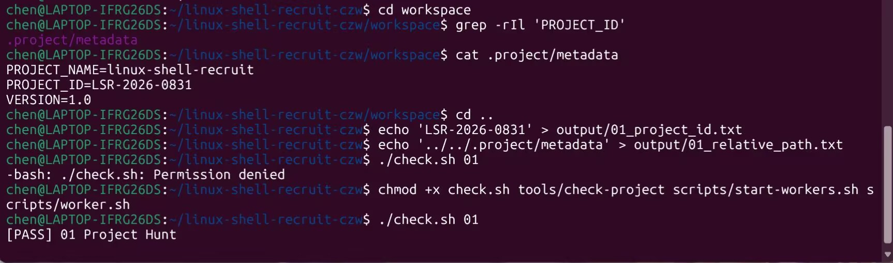
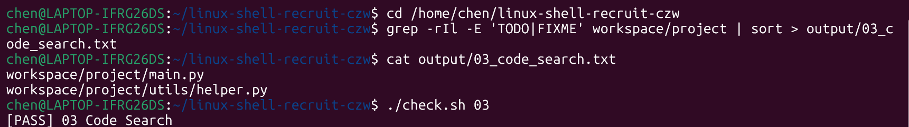
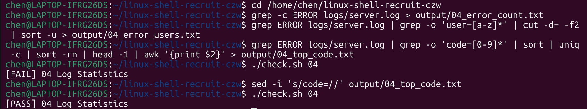
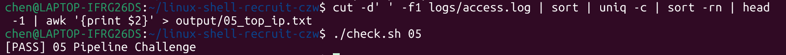
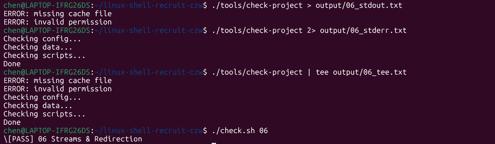
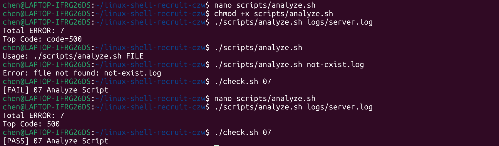
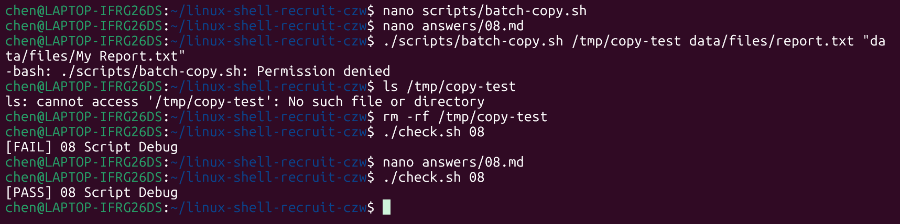
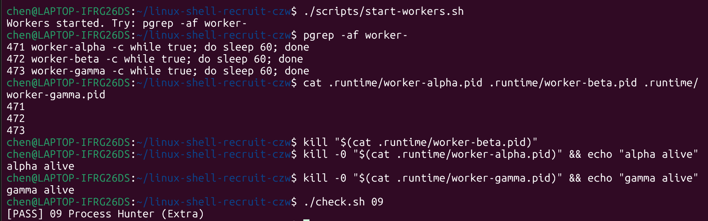
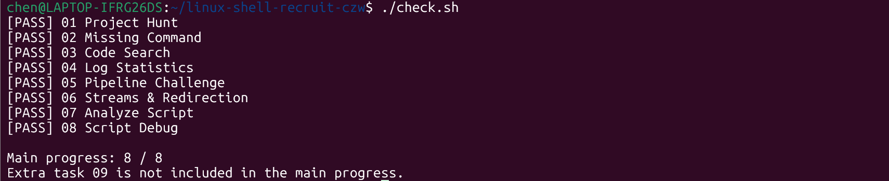

# task 01

## 用到的命令

cd /home/chen/linux-shell-recruit   进入目录

ls -la    显示目录全部内容（包括隐藏文件）

grep -rIl 'PROJECT_ID'   递归搜索包含PROJECT_ID的文件，只列出文件名

cat .project/metadata   查看文件内容，得到项目编号LSR-2026-0831

echo 'LSR-2026-0831' > output/01_project_id.txt   把内容写入文件（重定向）

./check.sh 01   运行校验脚本，确认答案正确

## 学习过程

使用codex协助了解命令以及其作用，并使用GitHub的api在终端中直接将运行结果放入该仓库。该过程对新手来说较为困难，在codex协助下会轻松很多。

## 结果

# task 02

## 用到的命令

chmod +x tools/recruit-info   给脚本添加执行权限

export PATH="$PATH:$HOME/.../tools"   把工具目录临时加进 PATH

nano answrs02.md   使用nano编辑器解答task02的问答题

## 学习过程

仿照一开始给的权限指令chmod +x check.sh tools/check-project scripts/start-workers.sh scripts/worker.sh（允许使用检查脚本），用chmod +x tools/recruit-info给脚本添加执行权限。题目在nano编译器里进行解答，首先要删除占位符，然后解答之后用ctrl+o保存，并用ctrl+x退出再执行即可通过。过程使用codex协助完成，在回答问题的时候nano里很多格式问题通过codex的解答最终顺利完成。

## 结果

# task 03

## 用到的命令

grep -rIl -E 'TODO|FIXME' workspace/project   递归搜索包含 TODO 或 FIXME 的文件，只列出路径

grep ... | sort   把结果按字典序排序

grep ... | sort > output/03_code_search.txt   把结果写入答案文件

## 学习过程

主要了解grep指令下各个参数的组合和含义，grep -l天然去重：一个文件里有多处匹配也只会被列一次，满足"每个路径只出现一次"；-E扩展正则：TODO|FIXME表示"或"的关系，匹配两者之一；-I忽略二进制文件：只保留普通文本文件，对应题目"普通文件"的要求；管道|命令：grep的输出直接交给sort，无需中间文件，体现"每个命令只做一件事"

## 结果

# task 04

## 用到的命令

grep -c ERROR logs/server.log   统计包含 ERROR 的行数

grep ERROR logs/server.log   筛选 ERROR 行

grep -o 'user=[a-z]*'   只提取 user=xxx 部分

cut -d= -f2   按 = 切分，取第 2 段（用户名）

sort -u   排序并去重

grep -o 'code=[0-9]*'   提取错误码

uniq -c   统计连续相同行出现的次数

sort -rn   按次数降序排列

head -1   取第一行（次数最多）

awk '{print $2}'   只保留第二列（错误码数字）

sed -i 's/code=//' output/04_top_code.txt   删除显示的code=

## 学习过程

有点像task03的拓展内容，也有使用grep下各种参数来解决问题，涉及到更多内容，比如：需要先看格式再写命令，每行日志的结构（字段位置、分隔符）决定了用 cut 还是 awk、取第几列。同时使用codex精简内容，比如sort | uniq这个管道内容，直接等价于sort -u，用于保证输出有序且唯一；以及一个陷阱，第三小题输出内容始终为code=500，使用sed将其清理，最终输出仅为500验证才能通过。

## 结果

# task 05

## 用到的命令

cut -d' ' -f1 logs/access.log   按空格切分，取第 1 列（IP 地址）

sort   排序，让相同 IP 相邻

uniq -c   统计每个 IP 的出现次数

awk '{print $2}'   只保留 IP，去掉次数前缀

## 学习过程

不用中间文件逐步传递数据，全部用管道 | 连接，与第四题的命令基本相同，不过所有环节用 | 连起来只执行一次，最终一个重定向 > 输出。

## 结果

# task 06

## 用到的命令

./tools/check-project > output/06_stdout.txt   把 stdout（正常输出）重定向到文件

./tools/check-project 2> output/06_stderr.txt   把 stderr（错误输出）重定向到文件

./tools/check-project | tee output/06_tee.txt   stdout 一边显示在终端、一边写入文件

## 学习过程

用两个通道的方式，编号成1，2，分别重定向，脚本故意把错误信息写到stderr，重定向stdout时ERROR留在终端，需要使用两条通道才能判断哪个文件该有什么。对新内容tee的解释：| tee文件一分为二：tee像三通管，把接到的 stdout复制一份给文件，一份继续输出到终端。第一行之后仍然输出了ERROR，codex给出的解释：> 默认只重定向 stdout：所以执行 命令 > 文件 时，ERROR 行仍会显示在终端，这是正常现象，不是失败。此外，2> 专门重定向 stderr：2> 是"文件描述符 2 重定向"的写法。

## 结果

 

# task 07

## 用到的内容

在nano中，用以下脚本完成该任务：

#!/usr/bin/env bash

#没有参数时显示 Usage 并退出

if [[ $# -ne 1 ]]; then
    
  echo "Usage: $0 FILE"
    
  exit 1

fi

FILE="$1"

#文件不存在时报错并退出

if [[ ! -f "$FILE" ]]; then
    
   echo "Error: file not found: $FILE"
    
   exit 1

fi

#统计 ERROR 条数

total=$(grep -c ERROR "$FILE")

#找出出现最多的错误码

top_code=$(grep ERROR "$FILE" | grep -o 'code=[0-9]*' | sort | uniq -c | sort -rn | head -1 | sed 's/.*=//')

#输出结果

echo "Total ERROR: $total"

echo "Top Code: $top_code"

## 学习过程

用codex完成脚本，并在其指导下分析理解该脚本内容，参数校验、文件校验用 if，统计分析直接复用前面用过的 grep | sort | uniq | head 管道。[[ $# -ne 1 ]] 表示"参数个数不等于 1 时"执行错误处理；$1 读取第一个参数：日志路径来自命令行，不写死在脚本里；[[ ! -f "$FILE" ]] 判断文件存在：-f 检查是否为普通文件，! 取反表示不存在；$(...) 命令替换：把一段命令的输出存进变量，例如 total=$(grep -c ERROR "$FILE")；exit 1 非零退出：错误情况下返回非零状态，让调用方知道脚本失败；正常结束不写 exit，默认返回 0。这道题有很多新内容，在codex协助下才能有较高完成度。

## 结果

# task 08

## 用到的内容

destination=$1

shift

mkdir -p "$destination"

for file in "$@"

do
    
   cp "$file" "$destination/"

done

## 学习过程

原内容是for file in $@，在询问codex哪里会引发bug后得知，不加引号的展开会"分词"：$file 若值为 My Report.txt，Shell 会按空格拆成 My 和 Report.txt 两个词，cp 就会找不到文件。"$@" 是处理多参数的黄金写法：它把每个命令行参数都当作独立的整体保留，既支持多个文件，也支持含空格的文件名；$@（不加引号）则会全部拆散。最后总结出看到"带空格出错"先想引号：这是 Shell 脚本最常见的 bug 类型，凡是引用变量/参数的地方都要检查是否加了双引号。

## 结果

# task 09

## 结果

# 最终任务汇总

